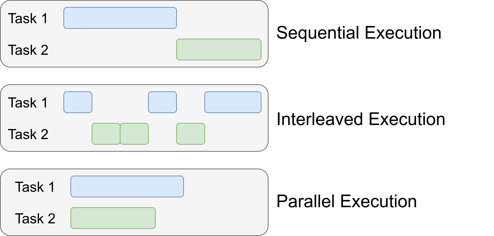

# 주차별 PR 양식입니다

# React에서 해석되는 동시성과 병렬성

React에서 "해석"되는 동시성과 병렬성의 개념을 이해하기 위해 동시성과 병렬성이 등장한 배경부터 알아봤습니다.

## 개념

동시성(Concurrency), 병렬성(Parallelism)


- 동시성
  - 작업들을 번갈아가며 수많은 작업들을 처리해가는 것
- 병렬성
  - 여러 작업을 동시에 수행하는 것

동시성과 병렬성의 근본적인 정의와 등장 배경을 먼저 살펴봅시다.

1. 초기 컴퓨터는 매우 비싸고 덩치가 컸음.
2. 점점 컴퓨터가 발전하면서 속도가 빨라졌지만 운영 과정은 여전히 복잡했음.
3. 예를들어 Fortran 같은 언어로 작성된 프로그램을 실행시키려면 메모리에 먼저 컴파일러를 로드해야 했고, 이후 어셈블리어로 변환되고 기계어로 변환되는 과정을 거쳐야 했음.
4. 이런 과정에서 설정 시간이 많이 소모되면서 CPU의 유휴시간이 발생됨
5. 이걸 해결하기 위해 연구진들은 여러 사람이 동시에 컴퓨터를 사용할 수 있도록 운영체제를 개발함.
6. 과정에서 하나의 CPU 처리장치 자원을 어떻게 공유 할 수 있을지 고민함
7. 이걸 해결하기 위해 프로그램을 더 작은 단위로 쪼개서 CPU가 해당 작업을 번갈아가며 실행할 수 있도록 함
   1. **동시성의 유래**
      
      
8. CPU에서 복수의 코어 개념이 등장하면서, 기존에 동시성을 사용한 멀티태스킹에서 멀티 코어를 사용한 멀티태스킹 방식으로 발전하게 된다.
   1. **병렬성의 유래**
      

동시성은 여러 작업을 동시에 처리하는 방법에 관한 것이고, 병렬성은 여러 작업을 실제로 동시에 수행하는 것입니다.


## Frontend와 동시성

1. Javascript는 단일 스레드 언어입니다. "병렬성"에 대한 개념보다는 "동시성"에 대한 개념이 적용되어 있습니다.
2. Javascript는 처음부터 Netscape라는 브라우저에서 동작하기 위해 설계되었습니다. 그 당시(1995년) 컴퓨터의 성능에서 멀티 코어를 유효하게 컨트롤하기 어려웠기 때문에 동시성 핸들링에 유리한 단일 스레드로 설계 되었습니다.
3. 이렇게 설계된 Javascript는 브라우저에서 Event Loop라는 "매커니즘"을 통해 비동기 작업을 관리합니다. 이를통해 I/O나 비동기 작업을 처리할때도 기본적인 단일 스레드 속성을 유지할 수 있게 합니다.
4. 따라서 Javascript로 동작하는 Web Frontend는 동시성에 대한 이해를 내포하고 있고, 브라우저가 동작하는 매커니즘을 이해하기 위해 Event Loop, Call Stack, Web Api, Task Queue의 이해가 필요합니다.
   1. 해당 내용은 여기에 자세히 나와있습니다. [이벤트 루프는 무엇입니까?](https://www.youtube.com/watch?v=8aGhZQkoFbQ&t=12s)

## 그럼 React에서는 어떻게 동시성을 관리하고 있을까?

### 1. 동시성

React는 18버전부터 동시성에 대한 개념을 두드러지게 강조했습니다.
기본 개념은 "UI렌더링은 사용자의 행동을 Block하면 안된다." 였습니다.
렌더링으로 사용자의 행동이 block되면 사용성에 큰 영향을 끼치기 때문이였습니다.
React 18 이전에는 렌더링중에 input이 block되는 경험은 흔했습니다.(물론 React 18 버전에서도 재현할 수 있습니다.)
[Block Render 예시](https://ajaxlab.github.io/deview2021/blocking/)

사용성을 위해 Frontend는 렌더링 성능 관리에 꼭 관심을 가져야 했습니다.
이를 해결하기 위해 React팀은 concurrent mode는 18버전부터 제대로 적용했습니다.(16 까지는 실험실 기능)
`동시성` 덕분에 UI 렌더링에 `우선순위`를 매겨 우선순위가 높은 순부터 브라우저가 `렌더링` 할 수 있었습니다.

또, 이전에는 state가 변하는 즉시 렌더링을 했기 때문에 동시에 상태가 변경되면 re-render가 여러번 일어나는 현상이 있었는데,
react18에서는 이걸 `Automatic Batching`을 도입하면서 불필요한 렌더링을 줄일 수 있었습니다.

> 공부하다보니 Fiber 내용이 계속 나오네요. reconciliation(재조정)의 알고리즘을 위해 도입된 아키텍쳐라고 합니다.
> Lane이라는 Fiber 아키텍쳐에서 동작하는 모델 이야기도 나오네요. [Lane 모델 톱아보기](https://goidle.github.io/react/in-depth-react18-lane/)

그럼 React에서 동시성의 우선순위는 어떻게 정해질까요?

### 2. 우선순위

React의 [ReactFiberWorkLoop.new.js](https://github.com/facebook/react/blob/v18.3.0/packages/react-reconciler/src/ReactFiberWorkLoop.new.js#L3088) 파일에 `scheduleCallback` 함수가 전체 렌더링 스케쥴링을 관리하는 함수라고 합니다.

- Immediate Priority (ImmediatePriority): 사용자 입력과 같이 즉각적인 반응이 필요한 작업에 사용됩니다.
- User Blocking Priority (UserBlockingPriority): 사용자 상호작용 후 즉시 처리해야 하는 작업.
- Normal Priority (NormalPriority): 일반적인 렌더링 업데이트 작업.
- Low Priority (LowPriority): 비긴급적인 작업 (예: 백그라운드 업데이트).
- Idle Priority (IdlePriority): 거의 모든 작업이 완료된 후 처리할 수 있는 작업.

우선순위는 이렇게 되고, 우선순위를 해석하는 코드는 아래와 같은데 해석하기 어렵네요 ㅠ

```ts
export function enqueuePendingPassiveProfilerEffect(fiber: Fiber): void {
  if (enableProfilerTimer && enableProfilerCommitHooks) {
    pendingPassiveProfilerEffects.push(fiber);
    if (!rootDoesHavePassiveEffects) {
      rootDoesHavePassiveEffects = true;
      scheduleCallback(NormalSchedulerPriority, () => {
        flushPassiveEffects();
        return null;
      });
    }
  }
}

// Lane에 대한 이해가 부족해서 해석하는게 어렵네요 ㅠ
function ensureRootIsScheduled(root: FiberRoot, currentTime: number) {
  // ...생략...

  const nextLanes = getNextLanes(
    root,
    root === workInProgressRoot ? workInProgressRootRenderLanes : NoLanes
  );

  // ...생략...
  const newCallbackPriority = getHighestPriorityLane(nextLanes);

  // ...생략...

  // SyncLane은 우선순위 숫자 상수 입니다.
  if (newCallbackPriority === SyncLane) {
    // ...생략...

    // 우선순위를 정해서 랜더링
    scheduleCallback(ImmediateSchedulerPriority, flushSyncCallbacks);
  } else {
    // 우선순위를 정해서 랜더링
    let schedulerPriorityLevel;
    switch (lanesToEventPriority(nextLanes)) {
      case DiscreteEventPriority:
        schedulerPriorityLevel = ImmediateSchedulerPriority;
        break;
      case ContinuousEventPriority:
        schedulerPriorityLevel = UserBlockingSchedulerPriority;
        break;
      case DefaultEventPriority:
        schedulerPriorityLevel = NormalSchedulerPriority;
        break;
      case IdleEventPriority:
        schedulerPriorityLevel = IdleSchedulerPriority;
        break;
      default:
        schedulerPriorityLevel = NormalSchedulerPriority;
        break;
    }
    newCallbackNode = scheduleCallback(
      schedulerPriorityLevel,
      performConcurrentWorkOnRoot.bind(null, root)
    );
  }
}
```

### 3. Transition

이렇게 중요한 동시성을 react 18 부터는 개발자가 주도해서 컨트롤 할 수 있도록 해줍니다.

- `startTransition`
- `useTransition`
- `useDeferredValue`

이 세가지 함수가 주인공입니다.

1.  먼저 `startTransition`은 UI Block을 일으키지 않고 상태를 변경 할 수 있습니다.
    변경된 상태가 우선순위가 낮게 렌더링 된다는 이야기입니다.

[코드 링크](https://playcode.io/2127023)

```
export function App(props) {
  const [value, setValue] = React.useState('');
  const [array, setArray] = React.useState([...Array(10000)]);

  const onChange = event => {
    setValue(event.target.value);
    // React.startTransition(() => {
    //   setArray(
    //     array.map((_, index) => Math.floor(Math.random() * 1000000000))
    //   );
    // });
    setArray(array.map((_, index) => Math.floor(Math.random() * 1000000000)));
  };

  return (
    <div className='App'>
      <h1>Hello React.</h1>
      <h2>Start editing to see some magic happen!</h2>
      <div>
        <input value={value} onChange={onChange} />
      </div>
      <div
        style={{
          display: 'flex',
          flexWrap: 'wrap',
          position: 'absolute',
          top: 0,
          left: 0,
          opacity: 0.3,
        }}
      >
        {array.map((data, idx) => (
          <div key={idx}>{data}</div>
        ))}
      </div>
    </div>
  );
}

```

2.  `useTransition`은 `startTransition`과 동일합니다.
    transition이 진행중인지 알려주는 `isPending` 상태값을 제공합니다.

[코드 예시](https://playcode.io/2127023)

```
export function App(props) {
  const [value, setValue] = React.useState('');
  const [array, setArray] = React.useState([...Array(10000)]);
  const [isPending, startTransition] = React.useTransition();

  const onChange = event => {
    setValue(event.target.value);
    startTransition(() => {
      setArray(array.map((_, index) => Math.floor(Math.random() * 1000000000)));
    });
  };

  return (
    <div className='App'>
      <h1>Hello React.</h1>
      <h2>Start editing to see some magic happen!</h2>
      <div>
        <input value={value} onChange={onChange} />
      </div>
      {isPending && <h3>Rendering....</h3>}

      <div
        style={{
          display: 'flex',
          flexWrap: 'wrap',
          position: 'absolute',
          top: 0,
          left: 0,
          opacity: 0.3,
        }}
      >
        {array.map((data, idx) => (
          <div key={idx}>{data}</div>
        ))}
      </div>
    </div>
  );
}
```

3.  `useDeferredValue`는 transition이 일어나는 상태값을 레핑합니다.

```
export function App(props) {
  const [value, setValue] = React.useState('');
  const [array, setArray] = React.useState([...Array(10000)]);
  const defferArray = React.useDeferredValue(array);

  const onChange = event => {
    setValue(event.target.value);
    setArray(array.map((_, index) => Math.floor(Math.random() * 1000000000)));
  };

  return (
    <div className='App'>
      <h1>Hello React.</h1>
      <h2>Start editing to see some magic happen!</h2>
      <div>
        <input value={value} onChange={onChange} />
      </div>
      <div
        style={{
          display: 'flex',
          flexWrap: 'wrap',
          position: 'absolute',
          top: 0,
          left: 0,
          opacity: 0.3,
        }}
      >
        {defferArray.map((data, idx) => (
          <div key={idx}>{data}</div>
        ))}
      </div>
    </div>
  );
}
```

## 중요 포인트

## 이런 것을 논의해보고싶어요!

- Lane에 대한 이해

### 이해를 위해 읽어보면 좋은 글

- [[번역] 동시성, 병렬성, 그리고 자바스크립트에 대한 이해
  ](https://velog.io/@surim014/concurrency-and-parallelism)
- [CONCURRENCY IS NOT WHAT YOU THINK](https://www.youtube.com/watch?v=3X93PnKRNUo)
- [Deview2021](<https://deview.kr/data/deview/session/attach/1_Inside%20React%20(%E1%84%83%E1%85%A9%E1%86%BC%E1%84%89%E1%85%B5%E1%84%89%E1%85%A5%E1%86%BC%E1%84%8B%E1%85%B3%E1%86%AF%20%E1%84%80%E1%85%AE%E1%84%92%E1%85%A7%E1%86%AB%E1%84%92%E1%85%A1%E1%84%82%E1%85%B3%E1%86%AB%20%E1%84%80%E1%85%B5%E1%84%89%E1%85%AE%E1%86%AF).pdf>)
-
