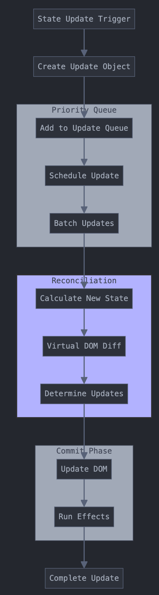

React에서 상태가 변화하는 과정을 요약하면 위 사진과 같다.

위 내용에 대해 자세히 살펴보자.

# 1. 초기 트리거 단계

## 1-1 useState를 이용해 상태를 생성

```typescript
function Counter() {
  const [count, setCount] = useState(0);

  const handleClick = () => {
    setCount(1);

    setCount((prev) => prev + 1);

    setTimeout(() => {
      setCount((prev) => prev + 1);
    }, 1000);
  };
}
```

## 1-2 업데이트 객체 생성

React는 업데이트가 발생할 때마다 Update 객체를 생성한다.

```typescript
interface Update<State> {
  lane: Lane; // 2-1에서 설명

  tag: UpdateTag; // 업데이트 타입으로 해당 에시에서는 state

  payload: any; // 새로운 상태 또는 상태를 계산하는 함수

  next: Update<State> | null; // 다음 업데이트에 대한 참조

  eventTime: number; // 업데이트 우선순위
}
```

실제 생성은 아래처럼 된다.

```typescript
const update = {
  lane: SyncLane,
  tag: UpdateState,
  payload: newState,
  next: null,
  eventTime: getCurrentTime(),
};
```

## 1-3 업데이트 큐에 추가

업데이트 큐는 아래와 같은 구조를 가지게 된다.

```typescript
interface UpdateQueue<State> {
  baseState: State; // 기본 상태 값 - 마지막으로 커밋된 상태
  firstBaseUpdate: Update<State> | null; // 업데이트 연결 리스트의 첫 번째 업데이트
  lastBaseUpdate: Update<State> | null; // 업데이트 연결 리스트의 마지막 업데이트
  shared: {
    pending: Update<State> | null; // 아직 처리되지 않은 대기 중인 업데이트
  };
  effects: Array<Effect> | null; // 사이드 이펙트 목록
}
```

### 큐 처리 과정

큐 처리는 초기화를 우선하고 업데이트를 연결하게 된다.

```typescript
const queue = {
  baseState: currentState,
  firstBaseUpdate: null,
  lastBaseUpdate: null,
  shared: {
    pending: null,
  },
  effects: [],
};
```

업데이트 연결을 할 때 첫 업데이트/기존 업데이트 상황에 따라 연결 리스트의 구조가 다르다.

```typescript
function enqueueUpdate(fiber, queue, update) {
  const pending = queue.shared.pending;
  if (pending === null) {
    update.next = update;
  } else {
    update.next = pending.next;
    pending.next = update;
  }
  queue.shared.pet nding = update;
}
```

## 1-4 중요한 특징들

### 배치 처리 (Batching)

배치 처리는 여러 상태 업데이트를 하나의 리렌더링으로 그룹화하는 프로세스다.

배치 처리를 통해 불필요한 렌더링을 최소화하고, 메모리 할당을 줄이는 등의 장점을 누릴 수 있다.

> React 18에서는 모든 업데이트가 자동으로 배치 처리된다.

### 트랜잭션 처리

트랜잭션은 여러 업데이트를 하나의 원자적 단위로 처리하여 일관성을 보장한다.

최대 장점은 원자성, 일관성, 격리성이 있다.

```typescript
// 트랜잭션 래퍼 예시
class ReactStateTransaction {
  constructor() {
    this.reinitializeTransaction();
    this.dirtyComponentsLength = null;
  }

  // 트랜잭션 시작 전 실행
  initialize() {
    this.dirtyComponentsLength = dirtyComponents.length;
  }

  // 트랜잭션 완료 후 실행
  close() {
    if (this.dirtyComponentsLength !== dirtyComponents.length) {
      // 추가 업데이트가 발생한 경우 처리
      dirtyComponents.splice(this.dirtyComponentsLength);
    }
    // 클린업 작업
  }
}

// 실제 사용 예시
function TransactionExample() {
  const [user, setUser] = useState(null);
  const [posts, setPosts] = useState([]);

  const updateUserData = async () => {
    try {
      // 트랜잭션 시작
      startTransaction();

      // 여러 상태 업데이트
      setUser(newUser);
      setPosts(newPosts);

      // 트랜잭션 커밋
      commitTransaction();
    } catch (error) {
      // 오류 발생 시 롤백
      rollbackTransaction();
    }
  };
}
```

# 2. 스케줄링 단계

## 2-1 우선순위 지정 (Lanes 시스템)

여기서 Lane은 비트 마스크를 사용하여 우선순위를 표현하는 방식으로, 각 비트는 특정 우선순위 레벨을 나타낸다.

우선 순위는 오른쪽으로 갈수록 낮아진다.
SyncLane(동기업데이트)=> InputContinuousLane(사용자 입력과 관련) => DefaultLane(일반적인 상태 업데이트) => TransitionLane(UI 전환 효과, 지연효과) => IdleLane(백그라운드 작업)

## 2-2 업데이트 배치 처리

배치 처리 메커니즘과 스케줄러의 긴밀한 상호작용을 기반으로 React의 성능과 사용자 경험을 최적화한다.

### 배치 처리 메커니즘

여러 상태 업데이트를 단일 배치로 그룹화하여 객체 생성하고 우선순위를 할당한다. 이 후 업데이트 큐에 순차적으로 추가된다.

배치 컨텍스트로 경계 설정하고, 비동기/동기 컨텍스트 구분하며 트랙잭션 단위를 정의하게 된다.

### 스케줄러 작동 방식

작업 스케줄링은 우선 순위 기반으로 큐 관리하며, 실행 시점 결정된다. (리소스 사용 최적화를 위해)

실행컨텍스트를 통해 브라우저 이벤트 루프와 통합된다.

## 2-3 불필요한 리렌더링 방지

메모리제이션 활용(useMemo, useCallback)과 선택적 렌더링(필요한 props만 전달해 불필요한 객체 생성 방지)을 기반으로 불필요한 리렌더링을 방지한다.

# 3. 재조정(Reconciliation) 단계

React의 재조정은 상태 변화를 실제 UI 변화로 변환하는 과정이다. 변경된 부분만 효율적으로 변화하는 것을 중점으로 다룬다.

## 3-1 새로운 상태 계산

React는 이전 상태와 들어온 업데이트들을 보고, 최종적으로 어떤 상태가 되어야 하는지 파악한다.

업데이트를 순서대로 처리해서 최종값이 정상적으로 나오도록 고려한다.

## 3-2 Virtual DOM 비교

현재 화면에 보이는 내용을 나타내는 Virtual DOM과 새로운 상태를 기반으로 만들어진 새로운 Virtual DOM을 비교한다.

이 과정에서 React는 Diff 알고리즘을 사용한다. Diff 알고리즘을 기반으로 전체를 변경하지 않고 바뀐 부분만 찾아 내서 변경한다. 그렇기에 'key' prop이 중요하게 다루어진다.

## 3-3 필요한 업데이트 결정

비교가 끝나면 React는 실제로 어떤 부분을 업데이트해야 할지 결정

- 텍스트만 변경되었다면 해당 텍스트만 업데이트
- 요소의 속성만 변경되었다면 속성만 업데이트
- 요소가 완전히 변경되었다면 해당 부분을 새로 생성

이러한 결정은 성능에 직접적인 영향을 미치기 때문에, React는 매우 신중하게 이 과정을 수행한다.

## 3-4 Fiber 트리 구성

Fiber 트리에 대한 내용은 `4번 Fiber(파이버) 아키텍처에서의 상태 관리 메커니즘 (심현준, 최여진)` 에서 다루기에 넘어감.

# 4. 커밋(Commit) 단계

커밋 단계는 React의 변경사항을 실제 DOM에 안전하게 적용하고, 부수 효과를 관리하며, 메모리를 효율적으로 관리하는 중요한 단계다.

동기적 실행, 부수 효과 관리, 성능 최적화를 중점으로 다루어 성능과 안정성에 직접적인 영향을 미친다.

## 4-1 실제 DOM 업데이트

삭제될 노드를 처리 => 새로운 노드를 마운트 => 기존 노드 업데이트 순서대로 DOM 업데이트를 진행한다.

그리고 DOM 조작 최적화를 위해 아래 3가지의 작업을 진행한다.

- 변경사항을 하나의 배치로 처리
- 레이아웃 트리거 최소화
- 브라우저 리페인트 최적화

## 4-2 부수 효과(Effects) 실행

부수효과에는 useLayoutEffect(레이아웃 효과) 와 useEffect(패시브 효과)가 있다.

### useLayoutEffect (레이아웃 효과)

DOM 변경 직후, 브라우저가 화면을 그리기 전에 동기적으로 실행

React가 DOM을 업데이트한 직후, 브라우저 페인팅 전에 발생

실행 순서: DOM 업데이트 → useLayoutEffect → 브라우저 페인팅

### useEffect (패시브 효과)

브라우저가 화면을 그린 후 비동기적으로 실행

React가 DOM을 업데이트하고 브라우저가 화면을 그린 후 발생

실행 순서: DOM 업데이트 → 브라우저 페인팅 → useEffect

## 4-3 참조 정리

참조 정리를 위해 ref 업데이트를 처리하고, 메모리 관리를 진행한다.

메모리 관리에는 가비지 컬렉션 준비(불필요한 참조 제거, 순환 참조 방지, 메모리 누수 방지)와 리소스 정리(이벤트 리스너 제거, 타이머 정리 ,외부 구독 취소)가 포함되어있다.

# 5. 완료 단계

React 애플리케이션의 안정성과 성능을 보장하는 중요한 단계다.

적절한 클린업, 메모리 관리, 그리고 다음 업데이트 준비를 통해 리소스 누수 방지, 안정적인 성능 유지, 일관된 사용자 경험 제공 등의 요소들을 보장한다.

## 5-1 클린업 함수 실행

클린업의 목적은 이전 렌더링의 부수 효과 정리, 리소스 누수 방지, 상태 일관성 유지 등이 있다.

클린업 실행 순서는 아래 3가지 단계를 거친다.

### 이펙트 클린업

```typescript
useEffect(() => {
  // 구독 설정
  const subscription = dataSource.subscribe();

  // 클린업 함수
  return () => {
    // 다음 이펙트 실행 전 또는 언마운트 시 호출
    subscription.unsubscribe();
  };
}, [dataSource]);
```

### 이벤트 정리

등록된 이벤트 리스너 제거, 타이머/인터벌 정리, 웹소켓 연결 종료 등을 통해 이벤트를 정리한다.

### 외부 연결 정리

이후에는 외부 연결인 데이터 구독 해제, 외부 API 연결 종료, 캐시 정리등을 진행한다.

## 5-2 메모리 정리

참조 정리, 캐시 관리, 가비지 컬렉션 준비를 통해 메모리를 정리한다.

## 5-3 다음 업데이트 준비

상태를 초기화하고 최적화 준비를 끝낸다.
