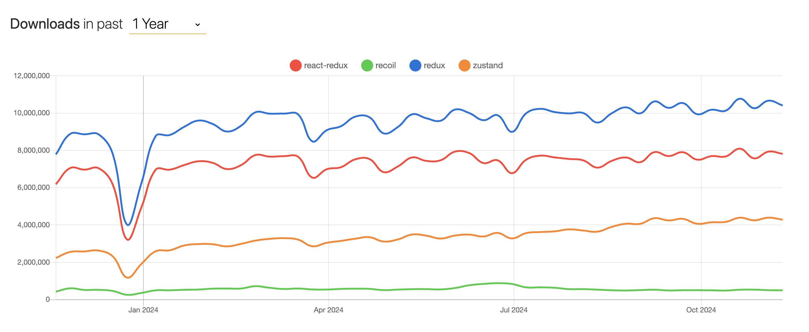

# 4주차 공통

## 리덕스 붐이 다시올까?

> 그러게요.. 올까요.. 과연…
>
> 안 오지 않을까… 이미 나와있는 상태관리 라이브러리들이 너무 잘 되어있어서..
>
> 근데 어떤 근거로..?

그래서 알아봤습니다.

우선 정말 아이러니하게도, redux의 연간 사용률은 다른 라이브러리의 사용률과 비슷한 양상으로 사용되고 있는 걸 확인할 수 있습니다.



그럼에도 불구하고 주변 사람들에게 물어보면 redux를 쓰는 경우를 거의 보지 못했는데요.

왜 사람들은 redux를 점점 멀리하게 되는 걸까요?

## Redux의 불편했던 점

예전에는 React에서의 상태관리로 당연하다는 듯 redux를 사용했습니다.

특히 비동기 상태는 state로 관리하기에는 한계점이 있기 때문에 redux를 통해서 비동기 데이터를 다루며 캐싱과 같은 최적화 작업까지 수행할 수 있도록 하였습니다.

비동기 데이터 측면으로 보았을 때, redux는 다른 상태 관리 라이브러리와 대비되는 단점들이 드러나기 시작했습니다.

1. 복잡해지는 Boilerplate코드

redux에는 기본적인 원칙이 존재하는데(단일 스토어 사용, 읽기 전용 상태, 순수 함수) 이를 충족하기 위해 Boilerplate코드를 요구합니다.

하나의 API 요청을 처리하기 위해 여러개의 Action과 Reducer를 사용하면서 코드에 대한 가독성이 떨어지기도하고, 복잡도도 더 높아지게 됩니다.

이를 해결하기 위해 redux-toolkit이 등장했지만 등장했음에도 여전히 불필요하게 반복되는 Boilerplate가 존재합니다.

2. 규격화되지 않은 API 요청 수행

그거 아시나요?
redux는 API 통신, 비동기 상태 관리 라이브러리가 아닙니다.

그래서 비동기 데이터를 관리하기 위해 하나 하나 개발자가 구현을 해야합니다.

예를 들어서 API 요청에 대한 응답 상태를 관리하는 코드가 있다고 합시다.

```typescript
// 로딩 상태를 관리하는 방법도 개발자에 따라 다르게 구현됩니다.
interface ApiState {
  data?: Data;
  isLoading: boolean;
  error?: Error;
}

interface ApiState {
  data?: Data;
  status: "IDLE" | "LOADING" | "SUCCESS" | "ERROR";
  error?: Error;
}
```

- 개발자의 선택에 따라서 응답을 전부 state로 보관하고 Selector에서 필요한 값만 계산할 수도 있고
- 보관할 때부터 필요한 것만 state에 보관하는 경우도 있습니다.

> 여기서 더 나아간다면 로딩 여부를 단순히 boolean으로 관리하냐, 하나씩 상태를 세분화하냐도 나눌 수 있겠네요!

이렇게 되는 이유는 redux가 비동기 데이터를 전문적으로 관리하는 라이브러가 아닌, `전역 상태 관리 라이브러리`이기 때문이죠.

이런 방식에 있어서 애플리케이션 볼륨이 커질수록, 한 애플리케이션에 담당하는 개발자가 많아질수록 통일하기 어려워지는 문제점이 생깁니다.

> 그래서 요즘은 tanstack/query를 사용하여 비동기 상태를 다루는 경우가 많아지고 있다고 합니다 👍

## 그래서 제 생각은요 . . .

"Redux의 붐이 다시 오기엔 어렵지 않을까" 싶습니다.
이미 많은 상태 관리 라이브러리가 계속 발전하고 있고, 특히 비동기를 다루는데에는 tanstack/query가 대부분의 문제를 해결해주고 있다고 생각합니다.(캐싱부터 ..)

그렇지만, 모든 상태관리의 기본이니 이걸 이해하고 다른 상태 관리라이브러리를 사용한다면 이해도가 훨씬 높아지는 경험을 하게 될 거라고 생각합니다.
