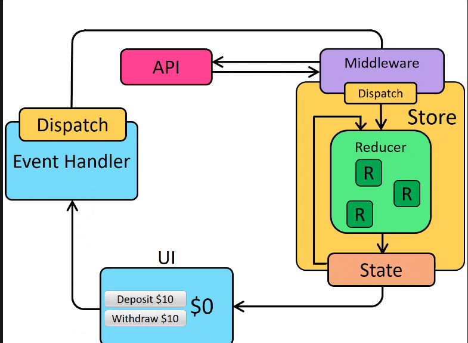

# createReducer , createSlice 동작 원리

### Redux 생태계

-   **redux** : vanilla 환경
-   **react-redux** : redux를 react에서 쓸 수 있도록
    -   useSelector
    -   useDispatch
-   **@reduxjs/tookit** : redux + react-redux + redux-thunk + 보일러플레이트 개선
    -   redux thunk : 간단한 사이드이펙트 처리에 적합한 middleware
    -   redux-saga : 복잡한 사이드이펙트 처리 middleware , generator 문법 사용

### redux상태관리 흐름

-   View(UI Component)
    -   event Handler에서 Dispatcher( action : UI event type) 호출
-   Middleware - 비동기처리, 로깅 , devTools 처리 등
-   Reducer ( action에 따른 새로운 상태를 반환 )
-   Store 적용 , View에 반영



```tsx
// 액션 타입
const INCREMENT = "counter/increment";
const DECREMENT = "counter/decrement";
const ADD_BY_AMOUNT = "counter/addByAmount";

// 액션 생성자
const increment = () => ({ type: INCREMENT });
const decrement = () => ({ type: DECREMENT });
const addByAmount = amount => ({
	type: ADD_BY_AMOUNT,
	payload: amount,
});

// 리듀서
const counterReducer = (state = { value: 0 }, action) => {
	switch (action.type) {
		case INCREMENT:
			return { value: state.value + 1 };
		case DECREMENT:
			return { value: state.value - 1 };
		case ADD_BY_AMOUNT:
			return { value: state.value + action.payload };
		default:
			return state;
	}
};
```

1. 액션 타입 변수 선언
2. 액션 생성자 함수
3. 각 액션 이벤트에 따른 상태를 반환할 리듀서함수 정의
4. 직접적인 불변성 처리를 필요

## createReducer

```tsx
import { createReducer } from "@reduxjs/toolkit";

// 액션 생성자는 여전히 필요
const increment = () => ({ type: "counter/increment" });
const decrement = () => ({ type: "counter/decrement" });

const counterReducer = createReducer({ value: 0 }, builder => {
	builder
		.addCase("counter/increment", state => {
			// immer를 통한 직접 수정 가능
			state.value += 1;
		})
		.addCase("counter/decrement", state => {
			state.value -= 1;
		})
		.addCase("counter/addByAmount", (state, action) => {
			state.value += action.payload;
		});
});
```

### createReducer는 무엇을 개선할까?

1. builder객체 문법으로 action switch-case문 제거
2. 내부적으로 immer를 활용하여, 불변성 처리가 간편해짐

### 흐음,,🤔 개선이라지만 뭔가 아쉽다.

---

## createSlice

store에 slice(독립적인 상태 조각)를 만든다.

1. slice name정의
    1. 상태를 나눈 slice에 name을 부여
2. initialState정의
    1. slice별 초기 상태값
3. reducer정의
    1. slice별 적용할 action을 명시
    2. createReducer문법을 적용가능 , extraReducers(외부 액션이나 비동기 액션을 처리) 지원

> createSlice ⇒ 추후 slice객체를 만들어서 actions, reducer 프로퍼티를 추출하여 store만들 때 주입

```tsx
import { createSlice } from '@reduxjs/toolkit'
import type { PayloadAction } from '@reduxjs/toolkit'

interface CounterState {
  value: number
}

const initialState = { value: 0 } satisfies CounterState as CounterState

const counterSlice = createSlice({
  name: 'counter',
  initialState,
  reducers: {
    increment(state) {
      state.value++
    },
    decrement(state) {
      state.value--
    },
    incrementByAmount(state, action: PayloadAction<number>) {
      state.value += action.payload
    },
  },
})

**export const { increment, decrement, incrementByAmount } = counterSlice.actions
export default counterSlice.reducer**
```

### configureStore에 reducer에 할당하여 store를 생성

개별 slice에서 reducer를 추출하여 통합된 rootReducer 형태로 store에 주입

-   복수의 reducer도 하나의 rootReducer로 통합된다. why?
-   _모든 액션이 하나의 파이프라인을 통과 //_ dispatch(action) -> rootReducer -> new state
-   상태간 의존성처리

    ```tsx
    // postSlice.js
    const postSlice = createSlice({
    	name: "posts",
    	initialState: [],
    	reducers: {
    		addPost: (state, action) => {
    			state.push(action.payload);
    		},
    	},
    });

    // userSlice.js
    const userSlice = createSlice({
    	name: "users",
    	initialState: {
    		list: [],
    		postCounts: {},
    	},
    	reducers: {},
    	extraReducers: builder => {
    		builder.addCase(postSlice.actions.addPost, (state, action) => {
    			// 사용자가 포스트를 작성할 때마다 카운트 증가
    			const userId = action.payload.userId;
    			state.postCounts[userId] = (state.postCounts[userId] || 0) + 1;
    		});
    	},
    });
    ```


[Redux 핵심, Part 5: Async Logic and Data Fetching | Redux](https://ko.redux.js.org/tutorials/essentials/part-5-async-logic/)

### createSlice를 사용하지 않는다면 다음과 같은 보일러플레이트 코드들이 필요함

-   액션 타입 정의
    ```tsx
    // createSlice 사용 시에는 자동 생성되는 부분
    const ADD_TODO = "todos/ADD_TODO";
    ```
-   액션 생성자함수 정의

    ```tsx
    // createSlice 사용 시에는 자동 생성되는 부분
    interface Todo {
      id: number
      text: string
      completed: boolean
    }

    interface AddTodoAction {
      type: typeof ADD_TODO
      payload: Todo
    }

    ~~// 액션 생성자 함수
    const addTodo = (todo: Todo): AddTodoAction => ({
      type: ADD_TODO,
      payload: todo
    })~~
    ```

-   리듀서함수 정의

### 개선방향

> 일반 reducer생성, 보일러 플레이트 코드
> → createReducer로 약간 간소화
> → createSlice로 한번에 처리

-   createReducer:
    -   Immer 지원 ✅
    -   액션 자동 생성 ❌
    -   builder 패턴 ✅
    -   매처 지원 ✅
-   createSlice:
    -   Immer 지원 ✅
    -   액션 자동 생성 ✅
    -   builder 패턴 ✅ (extraReducers)
    -   매처 지원 ✅
-   일반 리듀서:
    -   Immer 지원 ❌
    -   액션 자동 생성 ❌
    -   builder 패턴 ❌
    -   매처 지원 ❌
