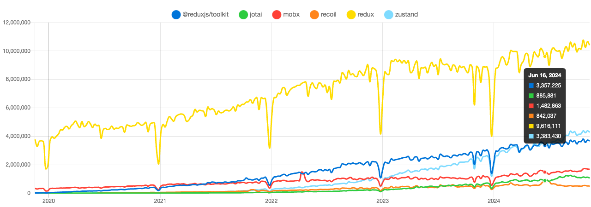

# 리덕스 붐은 올까?

[https://npmtrends.com/@reduxjs/toolkit-vs-jotai-vs-recoil-vs-redux-vs-zustand](https://npmtrends.com/@reduxjs/toolkit-vs-jotai-vs-recoil-vs-redux-vs-zustand)

### **현재 상황 분석**

-   Redux(주황색 선)는 여전히 다운로드 수(약 940만)에서 압도적 1위를 유지
-   하지만 증가세가 완만하며, 혁신적인 성장세는 보이지 않음
-   Zustand(파란색)와 Redux Toolkit(초록색)이 꾸준한 상승세를 보임

### **새로운 트렌드**

-   Zustand의 성장세가 두드러짐 (약 440만 다운로드)
-   Redux Toolkit도 안정적인 성장을 보임 (약 350만 다운로드)
-   Recoil, Jotai 등은 상대적으로 낮은 수치를 유지

### 결론

redux : 압도적인 1위 , 웹 프론트엔드 시장의 성장을 대변하는 지표

zustand : 23년 이후 성장세가 두드러짐, 24년 Redux Toolkit을 역전

추세가 이어진다면 zustand가 머지않아 1위가 되는 날이 올지도?..

