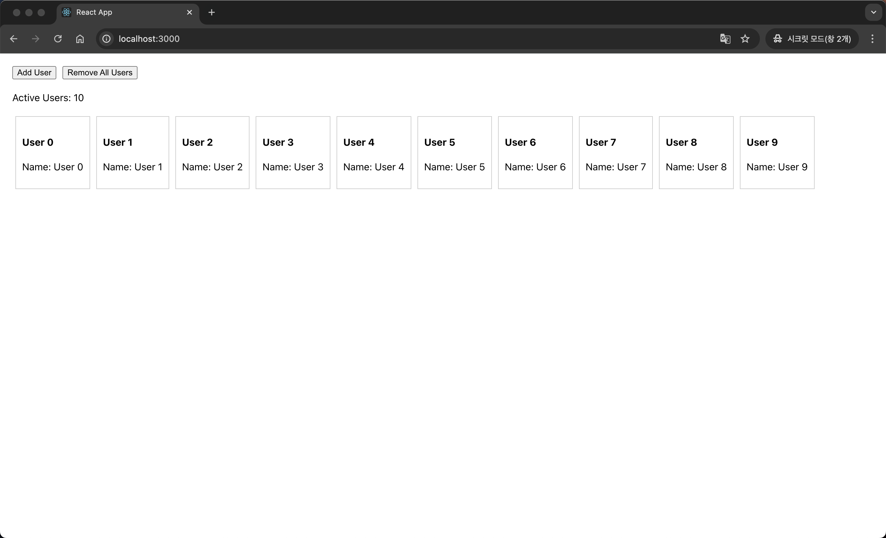
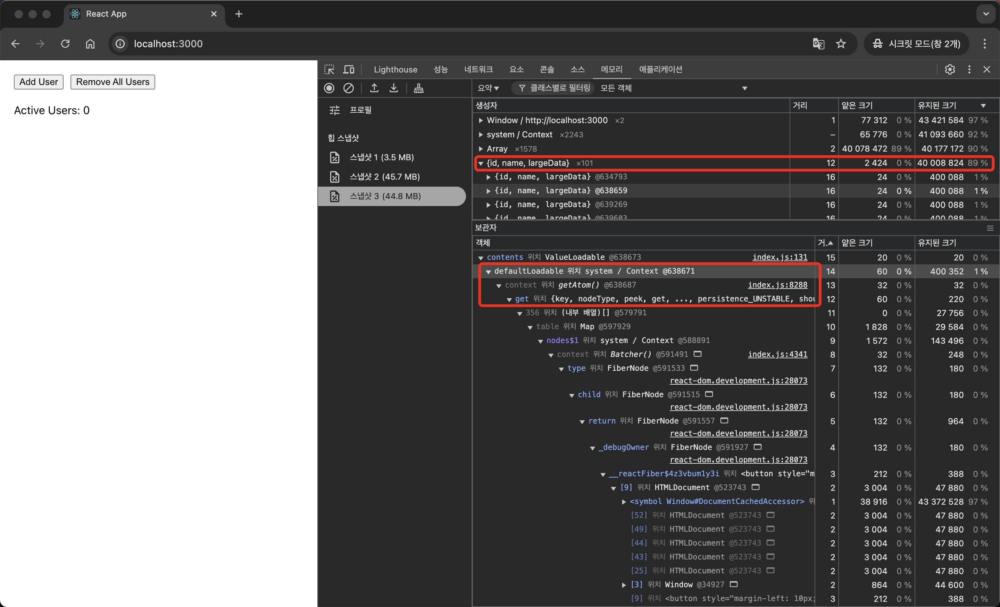
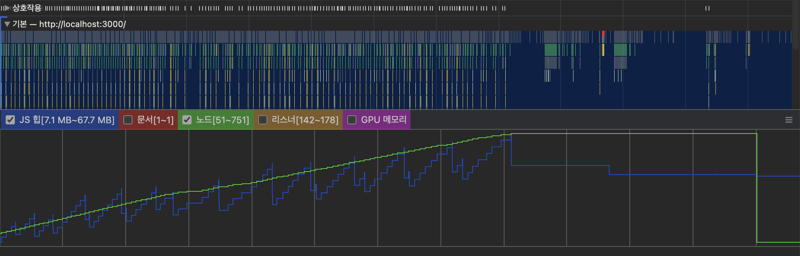

# Recoil 메모리 누수 문제 파헤치기

## 🌟 들어가며
Recoil 을 찾아보면서 [Recoil, 이제는 떠나 보낼 시간이다 ](https://medium.com/@clockclcok/recoil-%EC%9D%B4%EC%A0%9C%EB%8A%94-%EB%96%A0%EB%82%98-%EB%B3%B4%EB%82%BC-%EC%8B%9C%EA%B0%84%EC%9D%B4%EB%8B%A4-ff2c8674cdd5)  라는 글을 보게 되었습니다.
채용 공고를 보면 아직 Recoil 을 쓰는 곳이 많은데, 이 글에서 지적하는 Recoil 의 단점이 흥미로웠습니다.

위 글에서 언급하는 Recoil 의 단점은
1) 유지 보수 문제
	- Meta(Facebook) 의 지원이 부족하며 마지막 메이저 업데이트 (0.7.7) 이 2023년 4월 이후 없다 + 아직 v1.x 도 나오지 않았다 (cf. zustand 는 v5.0.1 이 10월 30일, jotai 는 v2.10.3 이 2주 전)
	- 많은 API들이 여전히 'unstable_' 접두사를 달고 있다
	- 메인테이너가 페이스북에서 퇴사하였다..
1) 기술적인 문제
	- atomFamily 와 관련된 메모리 누수 문제
	- 비동기 selector 의 캐시 관리 이슈
	- TypeScript 지원이 미흡
	- SSR 지원이 불안정
2) 구조적 한계
	- 복잡한 비동기 로직 처리
	- 전역 상태와 로컬 상태의 구분이 모호하다
	- atomic 한 상태 관리가 오히려 복잡성을 증가시킬 수 있다

등이 있었습니다.

 특히 Recoil GitHub에서 `atomFamily`/`selectorFamily` 관련 메모리 누수 [이슈](https://github.com/facebookexperimental/Recoil/issues/366)를 발견하고, 이 문제를 자세히 파악해보고 싶었습니다.

##  atomFamily 를 사용할 때 메모리 누수 확인하기

> `atomFamily`는 매개변수를 기반으로 atom을 동적으로 생성하는 Recoil의 기능입니다. 예를 들어, 사용자 ID를 매개변수로 받아 각 사용자별로 독립적인 상태를 관리할 수 있습니다.

### 실험 개요
- 화면에 새로운 사용자를 생성하는 "Add User", "Remove All User" 두 개의 버튼이 있습니다.
- 각 사용자는 고유한 ID 를 가지고 이 ID 를 기반으로 atomFamily 가 새로운 atom 을 생성합니다
- 각 사용자 데이터는 의도적으로 큰 메모리(1000,0000개의 문자열을 가진 배열) 사용하도록 합니다

### 실험 방법
1. Chrome DevTools의 Memory 탭 활용
2. 초기 상태의 heap snapshot 생성 (Snapshot 1)
3. "Add User" 버튼을 50회 클릭하여 사용자 추가
4. 두 번째 heap snapshot 생성 (Snapshot 2)
5. "Remove All User" 버튼을 클릭하여 사용자 모두 제거
6. 세 번째 heap snapshot 생성 (Snapshot 3)
7. Snapshots 비교 분석
	-  Snapshot 1과 2를 비교하여 메모리 증가량 확인
	-  Snapshot 2와 3을 비교하여 메모리 해제 여부 확인

### 실험용 코드 구현
먼저, atomFamily를 사용하여 큰 메모리를 가진 사용자 상태를 관리하는 코드를 구현하였습니다.
```tsx
// userState.ts
import { atomFamily } from 'recoil';

const createLargeData = (userId: string) => {
  return {
    id: userId,
    name: `User ${userId}`,
    // 메모리 사용량을 확인하기 위한 큰 데이터
    largeData: new Array(100000).fill(`Large data for user ${userId}`)
  };
};

// userId를 매개변수로 받아 새로운 atom을 생성
export const userStateFamily = atomFamily({
  key: 'userState',
  default: (userId: string) => createLargeData(userId)
});
```

다음으로, 사용자의 정보를 표시하는 컴포넌트를 구현하였습니다. 이 컴포넌트는 `atomFamily`로부터 해당 사용자의 상태를 구독하고 렌더링합니다.

```tsx
// UserComponent.tsx
import React from 'react';
import { useRecoilState } from 'recoil';
import { userStateFamily } from '../atoms/userState';

export function UserComponent({ userId }: { userId: string }) {
  // userStateFamily를 통해 해당 userId에 대한 atom을 구독
  const [userState] = useRecoilState(userStateFamily(userId));

  return (
    <div style={{ border: '1px solid #ccc', padding: '10px', margin: '5px' }}>
      <h4>User {userId}</h4>
      <p>Name: {userState.name}</p>
    </div>
  );
}
```

마지막으로, `App` 에서는 사용자를 추가하고 제거할 수 있도록 버튼을 추가하였습니다.

```tsx
function AppContent() {
  // 현재 표시중인 사용자 ID 목록
  const [userIds, setUserIds] = useState<string[]>([]);
  // 새로운 사용자 ID를 생성하기 위한 카운터
  const [counter, setCounter] = useState(0);

  const addUser = () => {
    const newUserId = counter.toString();
    setUserIds(prev => [...prev, newUserId]);
    setCounter(c => c + 1);
  };

  const removeUser = () => {
    setUserIds([]);
  };

  return (
    <div style={{ padding: '20px' }}>
      <div style={{ marginBottom: '20px' }}>
        <button onClick={addUser}>Add User</button>
        <button onClick={removeUser} style={{ marginLeft: '10px' }}>Remove All User</button>
      </div>
      <p>Active Users: {userIds.length}</p>
      <div style={{ display: 'flex', flexWrap: 'wrap' }}>
        {userIds.map(userId => (
          <UserComponent key={userId} userId={userId} />
        ))}
      </div>
    </div>
  );
}
```

이렇게 수정된 애플리케이션에서는 사용자를 추가할 때마다 새로운 atom이 생성되고, "Remove All Users" 버튼을 클릭하면 모든 컴포넌트가 한 번에 제거됩니다.



### 실험 결과

|단계|Heap 크기|메모리 변화 설명|
|------|-----------|------------------|
| 초기 상태 | 3.5 MB| 애플리케이션 시작 시 기본 메모리 사용 |
| 100명의 사용자 추가 후 | 45.7 MB | 각 사용자 추가 시 약 0.5 MB 증가 |
| 전체 사용자 제거 후 | 44.8 MB | 수동으로 가비지 컬렉터 동작시켜도 메모리 해제 미미 |

초기 상태(3.5MB)에서 100명의 사용자를 추가한 후 45.7MB로 메모리가 증가 한 후에
사용자를 모두 제거하여도 44.8MB로 거의 감소하지 않았습니다.

이는 `atomFamily`로 생성된 상태가 컴포넌트 제거 후에도 메모리에서 적절히 해제되지 않고 있음을 보여줍니다.




사용자를 모두 제거한 후의 Memory Snapshot 을 확인해보면 {id, name, largeData} x101 이라는 항목이 있습니다.
```
{id, name, largeData} x101
- Shallow Size: 2,424 bytes (0%)
- Retained Size: 40,008,824 bytes (89%)
```

각 객체가 참조하고 있는 largeData 배열을 포함한 전체 메모리 크기는 40,008,824 bytes 로 약 40MB 입니다.
이는 전체 메모리의 약 90%를 차지하고 있습니다.

`defaultLodable` , `getAtom()` 관련 코드로 보아 Recoil 내부 참조로 인해 가비지 컬렉터가 메모리를 회수하지 못하는 것으로 보입니다.

또한 Chrome Performance 탭에서도 메모리 누수 현상을 확인할 수 있었습니다.



사용자를 추가하면서 JS Heap 메모리가 증가하고, 사용자를 모두 제거한 후에 노드는 제거되지만 메모리는 해제되지 않았습니다.

이는 사용자 데이터를 모두 제거했음에도 불구하고 모두 메모리에 남아있어 메모리 누수가 발생하고 있음을 보여줍니다.

## 메모리 누수가 왜 일어날까
Recoil 의 내부 구현을 살펴보면서 메모리 누수가 왜 일어나는지 알아보았습니다.

### 1. atomFamily의 동작 방식
`atomFamily`는 파라미터마다 새로운 atom을 생성하고 캐시하는 팩토리 함수입니다.
```js
function atomFamily(options) {
  const atomCache = cacheFromPolicy({
    equality: options.cachePolicyForParams_UNSTABLE?.equality ?? 'value',
    eviction: 'keep-all'
  });

  return (params) => {
    const cachedAtom = atomCache.get(params);
    if (cachedAtom != null) {
      return cachedAtom;
    }

    // 새로운 atom 생성
    const newAtom = atom({
      ...atomOptions,
      key: `${options.key}__${stableStringify(params)}`,
      retainedBy_UNSTABLE:
        typeof options.retainedBy_UNSTABLE === 'function'
          ? options.retainedBy_UNSTABLE(params)
          : options.retainedBy_UNSTABLE,
    });

    atomCache.set(params, newAtom);
    return newAtom;
  };
}
```
### 2. atom 의 기본 RetainedBy 설정
Recoil의 atom은 생성될 때 `retainedBy` 옵션을 지정하지 않으면 기본값으로 `recoilRoot`가 설정됩니다.

```ts
// Recoil_Retention.js
function retainedByOptionWithDefault(r: RetainedBy | void): RetainedBy {
  return r === undefined ? 'recoilRoot' : r;
}

// Recoil_atom.js
function baseAtom<T>(options: BaseAtomOptions<T>): RecoilState<T> {
  const retainedBy = retainedByOptionWithDefault(options.retainedBy_UNSTABLE);
  // ...
}
```

### 2. release 불가능한 노드 판별
Recoil은 노드가 release 가능한지를 판단할 때, `retainedBy` 값이 `recoilRoot`인 노드는 release하지 않습니다.
```tsx
// Recoil_Retention.js
function findReleasableNodes(store, searchFromNodes) {
  // ...
  for (const node of downstreams) {
    // Not releasable if configured to be retained forever:
    if (getNode(node).retainedBy === 'recoilRoot') {
      nonReleasableNodes.add(node);
      continue;
    }
    // ...
  }
}
```
### 3. RecoilRoot 언마운트 시에만 정리

게다가 노드의 cleanup은 RecoilRoot가 언마운트될 때만 실행됩니다.

```tsx
// Recoil_RecoilRoot.js
useEffect(() => {
  const store = storeRef.current;
  // ...
  return () => {
    for (const atomKey of store.getState().knownAtoms) {
      cleanUpNode(store, atomKey);
    }
  };
}, []);
```

Recoil 팀도 이 문제를 인식하고 있어서, `The default will change from 'recoilRoot' to 'components' in the future.` 라는 주석이 존재합니다. 미래에는(..?) 기본값을 'components'로 변경할 계획이라고 합니다.

## 해결 방법
github 이슈에서 메모리 누수 문제를 해결하기 위해 직접 커스텀 가비지 컬렉터를 구현하는 방법을 찾을 수 있었습니다.

```tsx
export const RECOIL_GARBAGE_COLLECTOR_UNSTABLE = ({
  shouldCheckForGarbageCollection,  // 어떤 노드를 검사할지 결정하는 함수
  interval                         // 체크 주기(밀리초)
}) => {
  // 현재 Recoil store에 대한 참조를 가져옴
  const storeRef = useStoreRef()
  // 노드의 구독 정보를 가져오는 hook
  const getRecoilValueInfo = useGetRecoilValueInfo_UNSTABLE()

  // 미사용 노드 정리하는 콜백 함수
  const releaseUnusedNodes = useRecoilCallback(
    ({ snapshot }) => () => {
      // store가 없으면 종료
      if (storeRef.current === null) return

      // 현재 상태의 스냅샷을 유지
      const releaseSnapshot = snapshot.retain()
      const state = storeRef.current.getState()

      // 모든 노드를 순회
      for (const node of snapshot.getNodes_UNSTABLE()) {
        // knownAtoms나 knownSelectors에 없는 노드는 스킵
        if (!state.knownAtoms.has(node.key) && !state.knownSelectors.has(node.key)) {
          continue
        }

        // 검사 대상인 노드만 처리
        if (props.shouldCheckForGarbageCollection(node.key)) {
          // 노드 레벨의 첫 번째 구독자 확인
          const firstNodeSubscriber = snapshot
            .getInfo_UNSTABLE(node)
            .subscribers
            .nodes[Symbol.iterator]()
            .next()

          // 컴포넌트 레벨의 첫 번째 구독자 확인
          const firstComponentSubscriber = getRecoilValueInfo(node)
            .subscribers
            .components[Symbol.iterator]()
            .next()

          // 구독자가 하나도 없는지 확인
          const hasNoSubscriber =
            firstNodeSubscriber.done &&
            firstNodeSubscriber.value === undefined &&
            firstComponentSubscriber.done &&
            firstComponentSubscriber.value === undefined

          // 구독자가 없으면 노드 정리
          if (hasNoSubscriber) {
            releaseNode(storeRef.current, state.currentTree, node.key)
          }
        }
      }

      // 스냅샷 해제
      releaseSnapshot()
    },
    [getRecoilValueInfo, props, storeRef]
  )

  // interval 마다 정리 작업 실행
  useEffect(() => {
    const interval = setInterval(releaseUnusedNodes, props.interval)
    return () => clearInterval(interval)  // cleanup
  }, [props.interval, releaseUnusedNodes])

  return null
}
```

요약하자면, Recoil의 `useStoreRef` 를 내보내도록 라이브러리를 수정하고  `useGetRecoilValueInfo_UNSTABLE`을 활용해서 설정한 주기(ex.5초)마다 모든 Recoil 노드를 검사하여 구독중 상태가 없는 노드를 찾아냅니다. 이렇게 찾은 미사용 노드들을 Recoil 저장소에서 해당 노드의 참조 자체를 제거해서 메모리에서 정리함으로써 메모리 누수를 방지하는 방식으로 구현합니다.
# 결론
이번 분석을 통해 Recoil의 atomFamily가 가진 메모리 누수 문제를 직접 확인하고 코드를 보면서 원인을 파악할 수 있었습니다. `retainedBy`의 기본값이 `recoilRoot`로 설정되어 있고, SPA 환경에서 RecoilRoot가 거의 언마운트되지 않는 특성 때문에 메모리 누수가 발생하는 것을 확인했습니다.

Recoil 팀이 기본값을 'components'로 변경하겠다고 예고한 만큼 일시적인 문제일 수 있지만, 현재 Recoil의 유지보수 상태(마지막 메이저 업데이트가 2023년 4월)를 고려할 때, 이 기본값 변경이 언제 이루어질지는 불확실합니다.

메모리 누수는 치명적인 이슈이고, 내부 구현을 보면서 많은 `UNSTABLE` 을 목격했기 때문에 역시 `experimental state management library` 라는 것에 공감이 갔습니다.

# 참고
- [Recoil, 이제는 떠나 보낼 시간이다](https://medium.com/@clockclcok/recoil-%EC%9D%B4%EC%A0%9C%EB%8A%94-%EB%96%A0%EB%82%98-%EB%B3%B4%EB%82%BC-%EC%8B%9C%EA%B0%84%EC%9D%B4%EB%8B%A4-ff2c8674cdd5)
- [Recoil의 메모리 누수 문제](https://medium.com/@altoo/recoil%EC%9D%98-%EB%A9%94%EB%AA%A8%EB%A6%AC-%EB%88%84%EC%88%98-%EB%AC%B8%EC%A0%9C-fb709973acf2)
-  [Memory leak when using atomFamily/selectorFamily](https://github.com/facebookexperimental/Recoil/issues/366)
- [Recoil Issue: Memory Leak with atomFamily](https://github.com/facebookexperimental/Recoil/issues/314)
-  [SSR - Memory leak](https://github.com/facebookexperimental/Recoil/issues/1864)